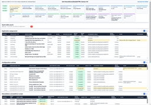
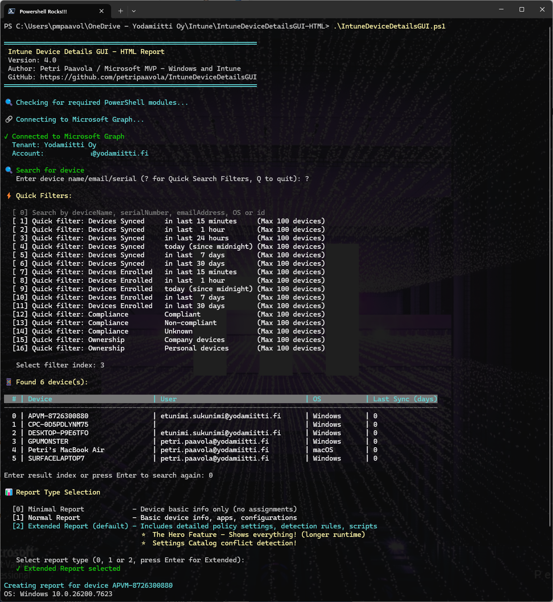
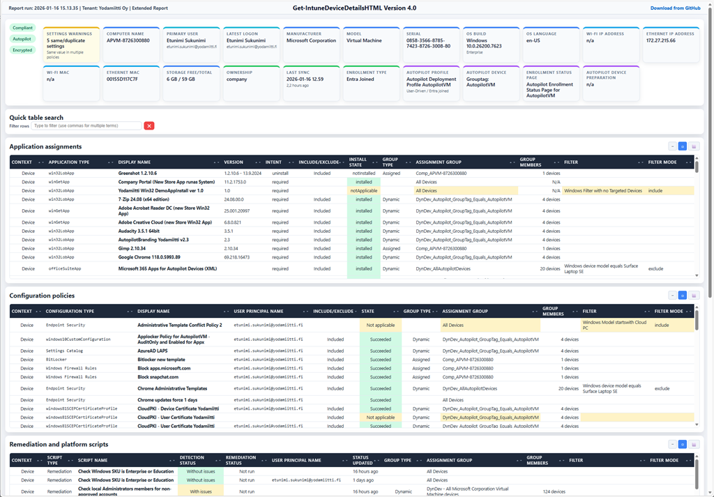

# 🚀 Intune Device Details GUI HTML - The Ultimate Report Tool

<div align="center">

### **Version 4.0** - The Next Generation
*Completely rebuilt from the ground up with AI-powered architecture*

[](https://github.com/PowerShell/PowerShell)
[](LICENSE)
[](https://www.microsoft.com/en-us/microsoft-365/enterprise-mobility-security/microsoft-intune)



[**🐛 Report Issues**](../../issues) | [**💡 Feature Requests**](../../issues)

</div>

---

## ⚡ Quick Start

1. **[Download IntuneDeviceDetailsGUI.ps1](./IntuneDeviceDetailsGUI.ps1)** and unblock (Properties → Unblock)
2. **Install module**: `Install-Module Microsoft.Graph.Authentication -Scope CurrentUser`
3. **Allow scripts**: `Set-ExecutionPolicy RemoteSigned -Scope CurrentUser`
4. **Run**: `.\IntuneDeviceDetailsGUI.ps1`
5. **Search device** by name, serial, or user (use **?** for built-in filters like "synced in last 24h")
6. **Select Extended Report** (default) for full features (conflict detection, scripts)
7. **HTML report opens** automatically in browser

---

## 🎯 What This Tool Does

**The "Resultant Set of Policy" for Intune** - Understand **WHAT should be configured and WHY** on device based on all assigned apps, policies, scripts, groups and filters.

### Complete Device Intelligence (v4.0)
**Device**: Hardware, OS, storage, network, sync, Autopilot, enrollment type, MDE status  
**Users**: Primary + logged-in users, group memberships with dynamic rules  
**Apps**: All Assignments for Device with install status, Win32 scripts (install/uninstall/detection/requirement), filters, application information  
**Policies**: All Assignments for Device with Complete settings for few policy types (e.g. Settings Catalog, OMA-URI), **conflict detection** ⭐  
**Scripts**: All Assignments for Device Remediation/platform/shell scripts (clear text script content, **execution output** with Remediations scripts)  
**Assignments**: Full chain (groups, filters, impact counts, dynamic rules)

### Hero Features (New in v4.0)
🎨 **HTML Reports** - Beautiful, searchable, shareable (replaced WPF GUI)  
🔍 **Universal Search & Filter** - **Search/filter** HTML tables **by ANY data** (names, settings, tooltips, policy content)  
🎯 **Interactive Tooltips** - Hover on -tooltips on top cards + **click any table row for detailed popup window**  
⭐ **Settings Catalog Conflict Detection** - Detects conflicts, duplicates, additive settings  
💎 **Win32App Script Visibility** - Install/uninstall scripts (Jan 2026 Graph API), Detection, Requirement scripts  
🪗 **Remediation Script Output** - See Detection, Remediation scripts AND actual execution results  
📚 **Living Documentation** - Self-contained HTML reports as configuration reference  
📸 **Configuration Baselines** - Save snapshots for comparison and rollback  
🌍 **Cross-Platform** - Windows, macOS (apps, shell scripts, .plist), iOS, Android  
🎯 **Three Report Types** - Minimal (quick), Normal (standard), Extended (full intelligence)

### Use Cases
**Troubleshooting** • **Documentation & Baselines** • **Incident Response** • **Change Management** • **Auditing**

**Breaking from v3.0**: WPF GUI → HTML reports (saved to `reports/` folder) • PowerShell 7.x + 5.1 support

[View Full Changelog](#-changelog)

---

## 📸 Screenshots

### Interactive Console

*Device search with built-in filters and report type selection*

### HTML Report

*Complete device intelligence in one beautiful HTML page*

---

## 📖 Usage Examples

**Interactive Search** (Recommended):
```powershell
.\IntuneDeviceDetailsGUI.ps1
# Select Extended Report for full features
```

**Optional: Pre-search device(s) list:**
```powershell
.\IntuneDeviceDetailsGUI.ps1 -SearchText "DESKTOP"
# Shows only devices matching "DESKTOP" in the selection list
```

---

## 🔐 Permissions

**Intune Role**: Intune Read Only Operator (minimum)  
**Graph Scopes**: 
- DeviceManagementManagedDevices.Read.All
- DeviceManagementConfiguration.Read.All
- DeviceManagementApps.Read.All
- DeviceManagementServiceConfig.Read.All
- DeviceManagementScripts.Read.All
- Group.Read.All
- GroupMember.Read.All
- User.Read.All
- Directory.Read.All

Script automatically requests permissions on first run.

---

## 🤝 Contributing

Contributions welcome! Fork → Feature branch → Pull Request  
[Report issues](../../issues) | [Request features](../../issues)

---

## 📝 Changelog

### Version 4.0 (January 2026)
Complete WPF → HTML rebuild • Settings Catalog conflict detection • Win32 app script visibility • Remediation script output • Three report types • 98% AI-written code • Performance optimizations • MDE detection • Enrollment type friendly names

### Version 3.0 (September 2024)
Remediation scripts • Enhanced tooltips • Graph API improvements

[View v3.0 Documentation](./old_version_3.0/README.md)

---

## 👨‍💻 Author

**Petri Paavola** - Microsoft MVP (Windows & Intune)  
[Intune.Ninja](https://Intune.Ninja) | [LinkedIn](https://www.linkedin.com/in/petri-paavola) | [@petripaavola](https://twitter.com/petripaavola)

---

## 🤖 AI-Powered Development

**~98% of v4.0 code written by Agentic AI** (GitHub Copilot, GPT-5.1-Codex, Claude Sonnet 4.5)

This project demonstrates true human-AI collaboration in software development. The complete WPF → HTML transformation with new features took only few days of intensive collaborative work.

**Developer's Role** (Petri Paavola):
- 🎯 Vision and architecture decisions
- 📋 Feature requirements and specifications
- 🔌 Microsoft Graph API endpoints and data structures
- 📊 Example JSON data and API responses
- ✅ Code review and validation
- 🔍 Quality assurance and sanity checks
- 🧪 Testing and verification
- 📊 Final approval on all changes

**AI's Role**:
- 💻 Code implementation
- 🔬 **JSON data schema analysis and parsing** (e.g., Settings Catalog nested structures)
- 💡 Technical suggestions and approaches
- 🔧 Refactoring and optimization
- 🐛 Bug fixes
- 📝 Documentation generation

**The Reality**: True 50-50 collaboration - Developer provided domain expertise (Graph API knowledge, Intune data structures, example JSON data), AI analyzed the data schemas and transformed that into working code. For example, Settings Catalog parsing logic was 100% AI-generated after analyzing the JSON structure. AI suggested approaches and implementation strategies, developer made final decisions and validated everything. Neither worked autonomously.

---

## 📄 License & Disclaimer

MIT License - Open source, review all code  
Provided "AS IS" - Test before production use  
Read-only operations (Intune Read Only Operator role)

---

<div align="center">

### 🌟 Star this repo if it helps you! 🌟

**Made with ❤️ by humans and 🤖 by AI**

*Version 4.0 - January 2026*

</div>
